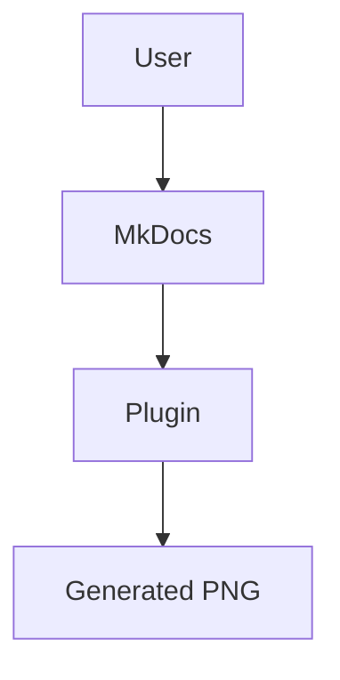

# mkdocs-mermaid-images

MkDocs plugin that replaces Mermaid code fences with generated PNG images.

## Basic setup

Add the plugin to your `mkdocs.yml`:

```yaml
site_name: My Docs

plugins:
  - search
  - mermaid-images
```

This default setup uses the `npx` renderer.

## Requirements

The plugin can render diagrams with one of three backends:

- `npx` (default): runs Mermaid CLI through `npx`
- `docker`: runs Mermaid CLI inside a container
- `api`: fetches PNGs from `mermaid.ink`

All renderers write hashed PNG assets under `assets/mermaid/`. PNG is the only generated output format.

### `npx` renderer

You do not need to install `@mermaid-js/mermaid-cli` globally. The plugin uses Mermaid CLI through `npx` when MkDocs builds the site.

Requirements:

- `node` and `npx` available on `PATH`
- network access on the first run so `npx` can fetch `@mermaid-js/mermaid-cli` if it is not already cached
- any system dependencies required by Mermaid CLI's headless browser on that platform

### `docker` renderer

The Docker renderer uses the official Mermaid CLI container image by default: `ghcr.io/mermaid-js/mermaid-cli/mermaid-cli`.

Requirements:

- `docker` available on `PATH`
- permission to run containers on the build machine
- any container runtime settings needed for Chromium on that platform

### `api` renderer

The API renderer targets `https://mermaid.ink` by default and avoids local Node, Chromium, and Docker requirements.

Requirements:

- outbound network access to the configured API endpoint

For locked-down Linux CI environments, you may also need to disable Chromium sandboxing for the CLI-based renderers. The demo site does this with `no_sandbox: !ENV [MKDOCS_MERMAID_IMAGES_NO_SANDBOX, false]`, and the GitHub Actions workflow sets that environment variable only in CI.

## Examples

Use either `mermaid` or `mermaidjs` fenced code blocks in Markdown:

````md
# Architecture


````

The built page will contain a normal Markdown image link instead of the code fence, and the generated file will be written under `assets/mermaid/`.

Repeated diagrams are rendered once and reused by content hash:

````md


````

Both fences will point at the same generated PNG.

You can also use `mermaidjs` fences:

```md
~~~mermaidjs
sequenceDiagram
    participant User
    participant Site
    User->>Site: Open docs
~~~
```

## Configuration

### Use the default `npx` renderer

```yaml
plugins:
  - mermaid-images:
      renderer: npx
      theme: default
```

### Use the Docker renderer

```yaml
plugins:
  - mermaid-images:
      renderer: docker
      theme: dark
```

Override the image if needed:

```yaml
plugins:
  - mermaid-images:
      renderer: docker
      docker_image: example/mermaid-cli:test
```

### Use the API renderer

```yaml
plugins:
  - mermaid-images:
      renderer: api
      theme: forest
```

Point it at a compatible endpoint and tune the timeout:

```yaml
plugins:
  - mermaid-images:
      renderer: api
      api_base_url: https://mermaid.ink
      api_timeout: 30
      theme: neutral
```

### Mermaid theme

Choose a site-wide Mermaid theme for all rendered diagrams:

```yaml
plugins:
  - mermaid-images:
      theme: dark
```

Supported values are `default`, `neutral`, `dark`, and `forest`.

This plugin-level theme is site-wide. Per-diagram Mermaid-native theme configuration remains outside the plugin's config surface.

### Chromium sandboxing for CLI renderers

For CI environments that require Chromium sandboxing to be disabled:

```yaml
plugins:
  - mermaid-images:
      no_sandbox: !ENV [MKDOCS_MERMAID_IMAGES_NO_SANDBOX, false]
```

`no_sandbox` applies to the `npx` and `docker` renderers only.

### Puppeteer config for CLI renderers

If you already have a Puppeteer config file, you can pass it through to Mermaid CLI:

```yaml
plugins:
  - mermaid-images:
      puppeteer_config_file: puppeteer-config.json
```

`puppeteer_config_file` applies to the `npx` and `docker` renderers only.

## Demo site

A minimal demo site lives in [examples/demo](https://github.com/peter-daly/mkdocs-mermaid-images/tree/main/examples/demo). It has a single page with a few Mermaid diagrams so you can verify the plugin renders them into image assets during the build.

Run it from the repository root:

```bash
uv sync
uv run mkdocs serve -f examples/demo/mkdocs.yml
```

Or use the `Makefile` targets:

```bash
make demo-serve
```

Or build the static site:

```bash
uv run mkdocs build -f examples/demo/mkdocs.yml
```

You can also run the repository checks from the root:

```bash
make ty
make test
make check
```

The generated files will be written to `examples/demo/site/`, and the rendered diagram images will appear under `examples/demo/site/assets/mermaid/`.
