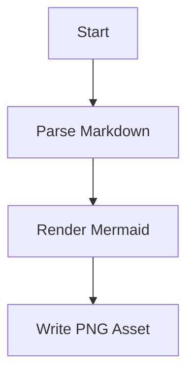
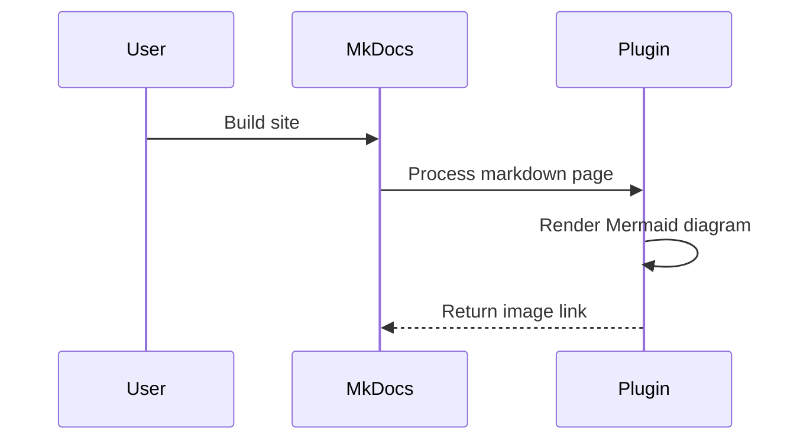
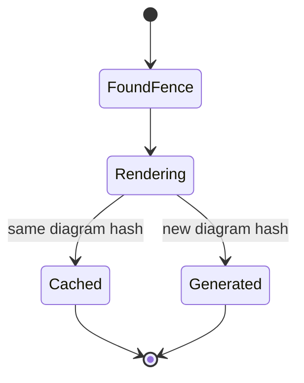

# Mermaid Images Demo

This page includes a few Mermaid fences. When MkDocs builds the site, the plugin replaces them with generated PNG images.

## Flowchart

## Sequence Diagram

## State Diagram

# Same Flowchart

